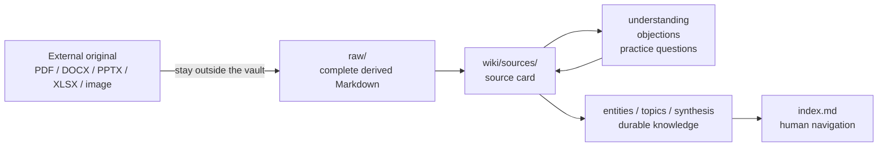

<div align="center">

# llm-wiki skill Human First

**An Obsidian knowledge base that people and AI agents can both read, question, and maintain.**

[中文](README.md) · [Install](#start-in-60-seconds) · [Workflow](#from-source-to-understanding) · [Agent rules](#rules-for-agents) · [License and credits](#license-and-credits)

[](LICENSE)
[](https://obsidian.md/)
[](https://www.markdownguide.org/)
[](AGENTS.md)

`local first` `source cards` `traceable evidence` `human-agent collaboration` `Obsidian` `Agent Skill`

</div>

> This project began with a personal question: after leaving school, how do I keep building knowledge? Notion? Obsidian? OneNote? Logseq? SiYuan?
>
> It is easy to install every new note-taking app. The small rush of accomplishment often ends there. The software is installed, so we feel like we have done the work. Later, we still do not want to use it, and do not know how to start.
>
> In the AI era, you do not need to master a complicated note-taking method before you begin to build knowledge.
>
> Put in an article, a file, or a piece of text. This Skill turns it into something easier to read, preserves where it came from, and creates a reading note that can keep improving. Just talk with the AI about your understanding, questions, or disagreements; it records them in the right place.
>
> Over time, the notes connect as a knowledge network and extend like a tree's root system. They help you strengthen what matters, whether it is a professional field or a new interest. When you look back later, you still have the spark of your original thinking and a reliable external brain. Each time, one link is enough to begin.
>
> Your everyday collection stops being material that merely occupies storage. It becomes knowledge you have understood, thought through, and can use again. Through revisiting, adding to it, and checking it, you can see your own growth.

## Why Human First

Most knowledge workflows optimize for retrieving an answer. This one optimizes for knowing why you believe it, where you disagree, and what to verify next.

| What you get | Failure mode it avoids |
|---|---|
| **Reading cards before evergreen notes** | Source text is dumped into a vault and never really read |
| **Conversation-written understanding, objections, and practice questions** | Learning disappears into chat history |
| **Complete derived text with locators** | A claim survives but its page, slide, or worksheet cannot be found |
| **Binary originals outside the vault** | PDFs, Office files, recordings, and private material get copied into Git |
| **Obsidian links and plain Markdown** | Knowledge is locked into a model or retrieval system |
| **One contract for humans and agents** | Human-readable notes and agent-maintainable structure drift apart |

## From Source to Understanding



### Four layers

1. **External originals** stay outside the vault and are referenced through `original_ref`.
2. **`raw/`** stores complete input or derived Markdown as the evidence layer. It is not a place for later personal feedback.
3. **`wiki/sources/`** stores source cards, where people and agents build understanding together.
4. **Entity, topic, and synthesis pages** retain only knowledge worth carrying across sources.

## Start in 60 Seconds

1. Install this directory as a compatible agent Skill.
2. Tell the agent: `Help me initialize a knowledge base`.
3. Give it a URL, local file path, or pasted text and say: `Ingest this material`.
4. Open the vault in Obsidian and read the resulting card in `wiki/sources/`.

You do not need to edit Markdown manually. Say:

> Add this to “Company Law Commentary Study Guide”: I think freedom of articles cannot override mandatory rules; next, I want to verify this with a share-transfer clause case.

The agent should write it in the matching source card, never by changing the `raw/` source text.

## A Source Card Keeps Learning Visible

Each source card records the original reference, text path, format, extraction method, locator scheme, and content hash. It keeps four durable feedback sections:

```markdown
## My notes and learning feedback

### My understanding
### Objections and reservations
### Practice and questions
### Feedback log
```

What you learned, where you disagree, and how you plan to verify it become part of the knowledge base rather than disposable chat residue.

## Rules for Agents

See [AGENTS.md](AGENTS.md) for the complete contract. The non-negotiables are:

- Read the vault-root `.wiki-rules.md` before writing.
- Never write a user's new opinion into complete `raw/` input text.
- Keep binary originals outside the vault and retain `original_ref`, `source_hash`, `extraction_method`, and locator metadata.
- Distinguish source facts, a user's interpretation, and an agent's inference.
- Propagate feedback to entity, topic, or synthesis pages only when the user asks.

## Capability Boundaries and Optional Adapters

The core flow supports local Markdown, TXT, HTML, PDF, and pasted text. Web, WeChat, and YouTube capabilities are optional adapters. When a module is missing, the agent must check its state, install it through the documented route, or use the manual fallback.

```bash
bash scripts/adapter-state.sh check <source_id>
```

The [optional adapter guide](docs/OPTIONAL_ADAPTERS.md) documents upstream sources, prerequisites, PATH checks, license checks, and fallbacks. It never asks users to put browser cookies, configuration, or personal material in this repository.

### MarkItDown Roadmap

MarkItDown is not wired in yet. Its future adapter will run in an isolated Python environment: binary originals remain outside the vault, only derived Markdown is written to `raw/`, and the converter version, hash, extraction method, and page, slide, or worksheet locators are recorded.

## Positioning

| Need | llm-wiki skill Human First choice |
|---|---|
| Fast answers | Supports queries, but does not confuse answers with a knowledge base |
| RAG or vector retrieval | Does not depend on it as the core experience |
| Human reading | Centers source cards, source trails, and navigable indexes |
| Agent automation | Constrains agents with explicit file boundaries and format contracts |
| Original files | Keeps them external; the vault stores derived text and traceable references |

## Contributing

Contributions that improve evidence locators, ingestion fallbacks, Obsidian navigation, or source-card ergonomics are welcome. Read [CONTRIBUTING.md](CONTRIBUTING.md) and the [publishing checklist](docs/PUBLISHING_CHECKLIST.md) first. Never submit a personal vault, original source document, browser profile, cookie, secret, or private URL.

## License and Credits

This project is a customized derivative of [sdyckjq-lab/llm-wiki-skill](https://github.com/sdyckjq-lab/llm-wiki-skill). The upstream project declares MIT in its README and `package.json`; this project retains the MIT license, upstream attribution, and third-party license notices. See [NOTICE](NOTICE), [PROVENANCE.md](PROVENANCE.md), and [THIRD_PARTY_NOTICES.md](THIRD_PARTY_NOTICES.md) for the evidence trail.

- Upstream Skill author: [sdyckjq-lab](https://github.com/sdyckjq-lab)
- Methodology: [Andrej Karpathy's llm-wiki gist](https://gist.github.com/karpathy/442a6bf555914893e9891c11519de94f)
- Maintainer of this customized distribution: [bangchuiLee](https://github.com/bangchuiLee)

For research, documentation, or public workflows, use [CITATION.cff](CITATION.cff).
