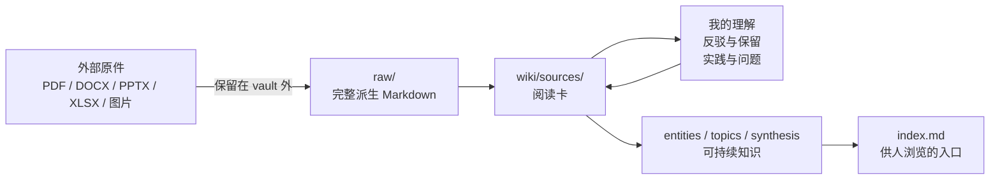

<div align="center">

# llm-wiki skill Human First

**让外部资料成为你和 AI 都能读、能质疑、能持续维护的 Obsidian 知识库。**

[English](README.en.md) · [安装](#60-秒开始) · [工作流](#从资料到理解) · [给-agent-的约束](#给-agent-的约束) · [许可证与致谢](#许可证与致谢)

[](LICENSE)
[](https://obsidian.md/)
[](https://www.markdownguide.org/)
[](AGENTS.md)

`本地优先` `阅读卡` `证据可追溯` `人机共用` `Obsidian` `Agent Skill`

</div>

> 这个项目起源于我自己的困惑：离开学校后，到底该用什么方式积累知识？Notion？Obsidian？OneNote？Logseq？思源笔记？
>
> 软件跟风装一堆，最大的成就感停留在安装的那一刻。软件一装，人就装起来了；现在再看，还是不想用也不会用。
>
> AI 时代，你不需要先学会复杂的笔记方法，才开始积累知识。
>
> 用这个 Skill，把一篇文章、一份文件或一段文字放进来，它会帮你整理成方便阅读的内容、保留出处，并生成一份可以持续完善的阅读笔记。你只需要和 AI 对话，说说理解、疑问或不同看法，它会帮你记录在合适的位置。
>
> 使用之后建立的笔记结构会像一张知识网彼此联结，也像大树根系不断延伸，帮你把该扎实的东西搞扎实，无论是专业领域还是最近的兴趣。一段时间后回看，笔记里既保有当初的思维火花，也建立起一个可靠的外置大脑。而你每次要给的，一个链接就够。
>
> 这样，日常收集的资料不再是放着占存储空间，而会逐渐变成你理解过、思考过、以后还能继续使用的知识资产。你也会在一次次回看、补充和验证中，看见自己的成长。

## 为什么是 Human First

大多数知识工作流优先优化“检索到答案”。这里优先优化“我为什么相信它、我哪里不同意、下一步如何验证”。

| 你得到的 | 它避免的常见问题 |
|---|---|
| **阅读卡先于永久笔记** | 原文被丢进 vault，之后再也没人真正读它 |
| **我的理解、反驳和实践问题可对话写入** | 关键学习过程散落在聊天记录里 |
| **完整派生文本与定位信息** | 结论留下了，但找不回页码、幻灯片或工作表 |
| **原始二进制文件留在 vault 外** | PDF、Office 文件、录音和隐私材料被复制进 Git |
| **Obsidian wikilink 和纯 Markdown** | 知识被锁进某个模型或检索系统 |
| **同一份人机契约** | 人看得懂的笔记与 Agent 能继续维护的结构脱节 |

## 从资料到理解



### 四层结构

1. **外部原件**：PDF、Office、图片等保留在 vault 外，通过 `original_ref` 回溯。
2. **`raw/`**：保存完整输入或派生 Markdown，是证据层；完成导入后不用于记录个人反馈。
3. **`wiki/sources/`**：阅读卡。人和 Agent 在这里共同形成理解。
4. **实体、主题、综合页**：仅沉淀跨来源仍值得保留的知识。

## 60 秒开始

1. 将此目录安装为兼容 Agent 的 Skill。
2. 对 Agent 说：`帮我初始化一个知识库`。
3. 提供一个链接、文件路径或文本，并说：`帮我消化这份资料`。
4. 用 Obsidian 打开 vault，在 `wiki/sources/` 阅读生成的阅读卡。

随后不必手改 Markdown。直接说：

> 在“公司法评注学习指南”里补充：我认为章程自治不能突破强制性规范，后续想找一个股权转让条款案例验证。

Agent 应将这段话写入对应阅读卡的反馈区，而不是改写 `raw/` 原文。

## 一张阅读卡，保留一次学习

每张阅读卡记录原件引用、文本路径、格式、提取方法、定位方案和内容哈希，并保留下面四个长期存在的区域：

```markdown
## 我的批注与学习反馈

### 我的理解
### 反驳与保留
### 实践与问题
### 反馈记录
```

这使“我学到了什么”“我暂时不同意什么”“我准备怎么验证”成为知识库的一部分，而不是一次性的聊天残留。

## 给 Agent 的约束

完整规则见 [AGENTS.md](AGENTS.md)。以下规则不可省略：

- 写入前先读 vault 根目录的 `.wiki-rules.md`。
- 不得把用户的新观点写回完整输入文本 `raw/`。
- 外部二进制原件留在 vault 外，并保留 `original_ref`、`source_hash`、`extraction_method` 和 locator 元数据。
- 严格区分“来源中的事实”“用户的理解”和“Agent 的推断”。
- 只有用户明确要求，才把阅读反馈传播到实体、主题或综合页。

## 能力边界与可选适配器

核心流程支持本地 Markdown、TXT、HTML、PDF 和粘贴文本。网页、公众号、YouTube 等能力是可选适配器；缺少模块时，Agent 必须先运行状态检查，再按安装说明补齐或使用人工回退。

```bash
bash scripts/adapter-state.sh check <source_id>
```

详见 [可选适配器指南](docs/OPTIONAL_ADAPTERS.md)。指南包含上游来源、安装前提、PATH 验证、许可证检查和失败回退，不会把浏览器 Cookie、配置或个人资料带进仓库。

### MarkItDown 计划

MarkItDown 尚未接入本版本。后续接入将使用隔离 Python 环境：原始二进制仍保留在 vault 外，只把派生 Markdown 写入 `raw/`，并记录转换器版本、哈希、提取方法及页码、幻灯片或工作表定位信息。

## 项目定位

| 需求 | llm-wiki skill Human First 的选择 |
|---|---|
| 快速问答 | 可以查询，但不把问答当作知识库本身 |
| RAG / 向量检索 | 不依赖它作为核心体验 |
| 人类阅读 | 把阅读卡、来源链路和索引放在中心 |
| Agent 自动化 | 受明确文件边界和格式契约约束 |
| 原件管理 | 原件外置，vault 保留派生文本和可追溯引用 |

## 贡献

欢迎改进证据定位、导入回退、Obsidian 导航和阅读卡体验。提交前请阅读 [CONTRIBUTING.md](CONTRIBUTING.md) 与 [发布检查清单](docs/PUBLISHING_CHECKLIST.md)。不要提交个人 vault、原始资料、浏览器配置、Cookie、密钥或私有 URL。

## 许可证与致谢

本项目是对 [sdyckjq-lab/llm-wiki-skill](https://github.com/sdyckjq-lab/llm-wiki-skill) 的定制化衍生版本。原项目在 README 与 `package.json` 中声明 MIT；本项目保留 MIT 许可、上游归属和第三方许可证通知。详细证据见 [NOTICE](NOTICE)、[PROVENANCE.md](PROVENANCE.md) 和 [THIRD_PARTY_NOTICES.md](THIRD_PARTY_NOTICES.md)。

- 上游 Skill 作者：[sdyckjq-lab](https://github.com/sdyckjq-lab)
- 方法论来源：[Andrej Karpathy 的 llm-wiki gist](https://gist.github.com/karpathy/442a6bf555914893e9891c11519de94f)
- 本定制发行版维护者：[bangchuiLee](https://github.com/bangchuiLee)

在研究、文档或公开工作流中使用本项目时，请参考 [CITATION.cff](CITATION.cff)。
