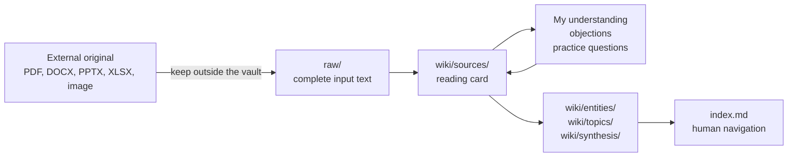

<div align="center">

# llm-wiki

**Human-readable knowledge bases for Obsidian, maintained by people and agents together.**

[](LICENSE)
[](https://www.markdownguide.org/)
[](https://obsidian.md/)
[](AGENTS.md)

`Obsidian` `personal knowledge management` `AI agents` `reading notes` `Markdown`

[Why llm-wiki](#why-llm-wiki) · [How it works](#how-it-works) · [Quick start](#quick-start) · [For agents](#for-agents) · [Contributing](#contributing)

</div>

## Why llm-wiki

Most knowledge workflows optimize for retrieval. **llm-wiki optimizes for understanding.** It keeps the trail from a source to a reading card, then to durable concepts and topics that a person can browse, question, and revise in Obsidian.

| Designed for llm-wiki | Common failure mode it avoids |
|---|---|
| **A shared human-agent contract** | The agent writes notes that only the agent can interpret later |
| **Reading cards before evergreen pages** | Raw text is dumped into a vault without an entry point for learning |
| **Conversation-driven learning feedback** | Personal understanding and objections disappear into chat history |
| **Traceable source metadata** | A claim survives but its source, page, slide, or worksheet is lost |
| **External originals stay external** | Large or sensitive PDFs, Office files, and recordings get copied into Git or the vault |
| **Plain Markdown and Obsidian links** | Knowledge is trapped in a proprietary retrieval system |

This is not a RAG corpus with a Markdown skin. It is a navigable, inspectable learning system where people remain able to read the source trail and decide what they believe.

## How It Works



### The four layers

1. **External originals** stay outside the vault. A reading card records a stable path or URL in `original_ref`.
2. **`raw/`** stores complete Markdown input text. It is the evidence layer and becomes read-only after ingest.
3. **`wiki/sources/`** stores reading cards. This is where the person and agent build understanding together.
4. **Entities, topics, and synthesis pages** hold cross-source knowledge worth preserving after the source has been read and linked.

## A Reading Card Is a Learning Surface

Every new reading card records source type, original reference, text path, format, extraction method, locator scheme, and content hash. It also contains four durable feedback sections:

```markdown
## 我的批注与学习反馈

### 我的理解
### 反驳与保留
### 实践与问题
### 反馈记录
```

You do not need to edit Markdown manually. Say something like:

> 在“公司法评注学习指南”里补充：我认为章程自治不能突破强制性规范，后续想找一个股权转让条款案例验证。

The agent writes that into the appropriate reading-card sections, preserves the original input text, and only updates topic or concept pages when you explicitly request it.

## Quick Start

1. Install this directory as a compatible agent Skill.
2. Ask the agent to initialize an Obsidian knowledge base.
3. Provide a URL, local text file, pasted text, or a supported external adapter.
4. Read the generated card in `wiki/sources/`, then use conversation to add your understanding and objections.

The Skill entrypoint is [SKILL.md](SKILL.md). Its page-format contract is generated into each vault as `.wiki-rules.md`.

## For Agents

Read [AGENTS.md](AGENTS.md) first. The non-negotiable rules are:

- Read the vault's root `.wiki-rules.md` before writing pages.
- Never overwrite complete `raw/` input text when recording feedback.
- Keep external binary originals outside the vault and preserve `original_ref`.
- Distinguish a source claim from the user's interpretation or objection.
- Maintain Obsidian wikilinks and source traceability.

## Optional Adapters

The public core intentionally does not bundle web or YouTube extractor implementations. Install adapters separately so their licenses, browser credentials, and runtime dependencies stay explicit. The adapter guide gives both people and agents an installation-and-verification protocol, including manual fallbacks for unavailable capabilities. See [docs/OPTIONAL_ADAPTERS.md](docs/OPTIONAL_ADAPTERS.md).

MarkItDown is planned as an optional local-file conversion adapter. It will preserve binary originals outside the vault and write only derived Markdown to `raw/` with converter metadata and page/slide/sheet locators.

## Project Status

The current public core reflects the customized `llm-wiki` **3.6.2** workflow. It is usable for local Markdown-based knowledge work and is evolving toward a traceable MarkItDown ingestion adapter.

## Contributing

Contributions are welcome when they preserve the human-readable knowledge model. Read [CONTRIBUTING.md](CONTRIBUTING.md) and the [publishing checklist](docs/PUBLISHING_CHECKLIST.md) before submitting changes.

## Citation and License

Use [CITATION.cff](CITATION.cff) when citing this project. Original llm-wiki code and documentation are MIT licensed; third-party graph assets retain their own licenses and notices in [THIRD_PARTY_NOTICES.md](THIRD_PARTY_NOTICES.md).
